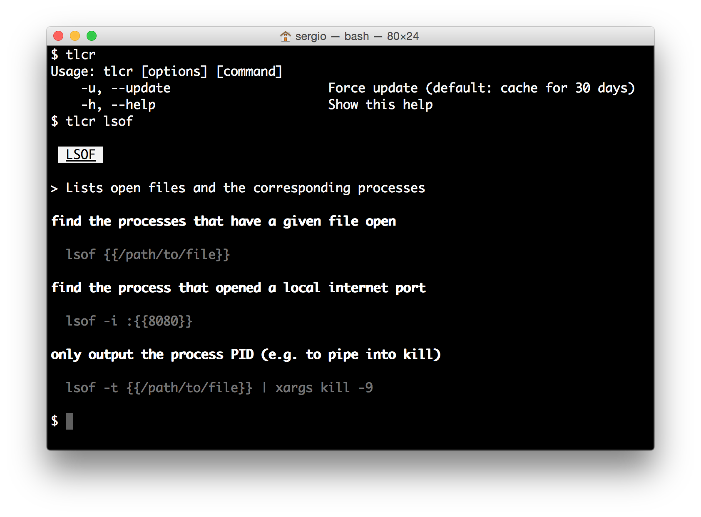

# TLCR 

`tlcr` is a simple terminal-based client for [TLDR pages](http://tldr-pages.github.io/), written in
[Crystal](http://crystal-lang.org/).

> *TLDR pages* is a collection of simplified and community-driven man pages.

`tlcr` is on an early stage of development. It mostly works and can be used, but testing and issues reporting is 
appreciated.

## Features

* Simple CLI
* Colorized Markdown rendering in the terminal
* Local file based cache
* Bash completion
* No dependencies

### Planned features

* Batch download
* Local file rendering (for authors)

## Installation

### Mac

(tested on Yosemite, reports on other versions welcome)

    $ brew tap porras/tap
    $ brew update
    $ brew install tlcr

### Linux

TODO: Create binary packages for easy installation. Help welcome!

## Usage

    Usage: tlcr [options] [command]
    -u, --update                     Force update (default: cache for 30 days)
    -h, --help                       Show this help

### Bash completion

After having `tlcr` installed, add this to your `.bashrc`:

    eval "$(tlcr --completion)"

## Development

You need [Crystal 0.10.0](http://crystal-lang.org/docs/installation/index.html) installed (it might work with older
or newer versions, but that's the one that's tested).

After checking out the repo (or decompressing the tarball with the source code), run `shards` to get the development
dependencies, and run `crystal build tlcr.cr` (`crystal build --release tlcr.cr` if you intend to install it for real
use). The `tlcr` binary generated in the directory can be copied anywhere in your `$PATH`.

## Contributing

1. Fork it ( https://github.com/porras/tlcr/fork )
2. Create your feature branch (git checkout -b my-new-feature)
3. Commit your changes (git commit -am 'Add some feature')
4. Push to the branch (git push origin my-new-feature)
5. Create a new Pull Request

## Contributors

- [porras](https://github.com/porras) Sergio Gil - creator, maintainer
