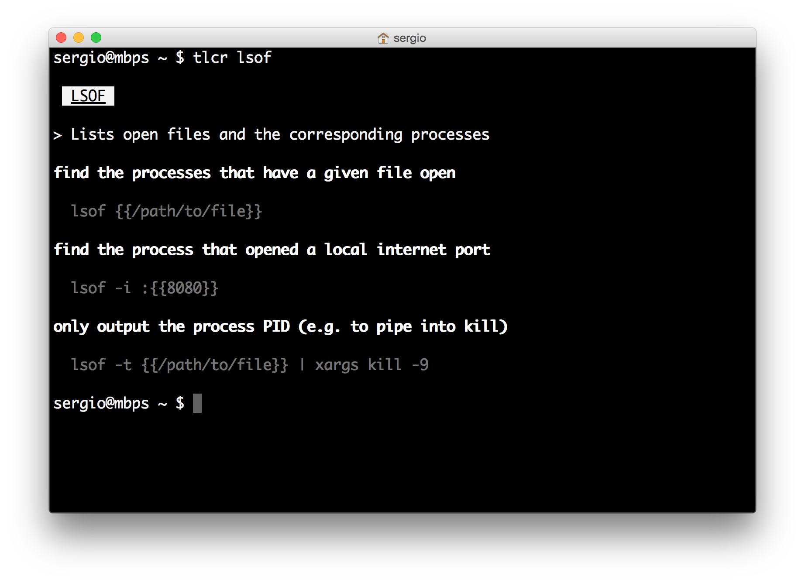

# TLCR 

`tlcr` is a simple terminal-based client for [TLDR pages](http://tldr-pages.github.io/), written in
[Crystal](http://crystal-lang.org/).

> *TLDR pages* is a collection of simplified and community-driven man pages.

`tlcr` is under development. It works and can be used, but testing and reporting issues is appreciated.

## Features

* Simple CLI
* Colorized Markdown rendering in the terminal
* Local file based cache
* Bash completion
* No dependencies
* Local file rendering (for authors)
* Batch download

## Installation

### Mac

    brew tap porras/tap
    brew install tlcr

Or, if you want to install the latest, unreleased version:

    brew tap porras/tap
    brew install tlcr --HEAD

### Linux

#### Ubuntu/Debian

There is an APT repository with signed packages of the latest tlcr version. To setup this repo and install tlcr, run the following commands (as root or with sudo):

    apt-key adv --keyserver keys.gnupg.net --recv-keys ED2715FE
    echo "deb http://iamserg.io/deb packages main" > /etc/apt/sources.list.d/iamserg.io.list
    apt-get update
    apt-get install tlcr

#### Other distributions

See how to [install from source](#from-source) below.

### From source

If there are no binary packages for your OS version, you can install `tlcr` building it from source. See
[Development](#development) for instructions.

## Usage

    Usage: tlcr [options] [command]
        -u, --update                     Force update (default: cache for 30 days)
        -r, --render                     Render local file (for authors)
        -d, --download                   Download the whole TLDR archive
        -h, --help                       Show this help

### Examples

Displaying a page:

    $ tlcr ls

Displaying a page, forcing its download (and the download of the index):

    $ tlcr --update ls

Displaying a page from a local file (useful if you're contributing to [TLDR pages](https://github.com/tldr-pages/tldr)
and want to have a look before submitting a patch):

    $ tlcr --render tldr/pages/common/ls.md

Downloading the whole archive (it will download everything at once and store it in the normal cache, where it will
expire, in the normal way, after 30 days, when it can be downloaded either completely again, or on demand page by page,
as normal):

    $ tlcr --download

### Bash completion

After having `tlcr` installed, add this to your `.bashrc`:

    eval "$(tlcr --completion)"

You don't need this if you installed via Homebrew (it's automatic).

## Development

You need [Crystal 0.19.x](http://crystal-lang.org/docs/installation/index.html) installed (it might work with older
or newer versions, but that's the one that's tested).

After checking out the repo (or decompressing the tarball with the source code), run `shards` to get the development
dependencies, and run `crystal build tlcr.cr` (`crystal build --release tlcr.cr` if you intend to install it for real
use). The `tlcr` binary generated in the directory can be copied anywhere in your `$PATH`.

## Contributing

1. Fork it ( https://github.com/porras/tlcr/fork )
2. Create your feature branch (git checkout -b my-new-feature)
3. Commit your changes (git commit -am 'Add some feature')
4. Push to the branch (git push origin my-new-feature)
5. Create a new Pull Request

## Contributors

- [porras](https://github.com/porras) Sergio Gil - creator, maintainer
